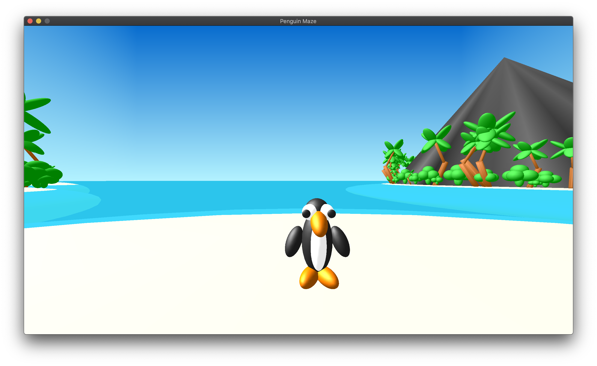
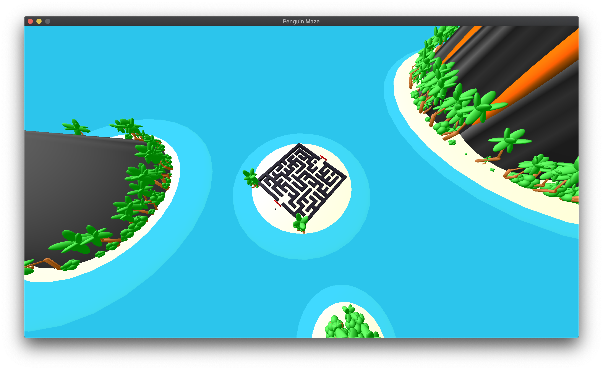

# CS 7610 Project: Penguin Maze

## About

Project for a computer graphics course in Spring 2020. I implemented the Aldous-Broder algorithm for generating a maze and created a 3D game to guide a penguin through the maze. For the game environment, I tried to go with an island theme. The game is programmed written in C / C++ / Objective-C using OpenGL for the graphics and Cocoa for the GUI.

## Controls
| Action                      | Control |
|-----------------------------|:-------:|
| Move Forward                | ⬆️      |
| Move Backward               | ⬇️      |
| Turn Left                   | ⬅️      |
| Turn Right                  | ➡️      |
| Switch to Bird's Eye View   | 1️⃣      |
| Switch to First Person View | 2️⃣      |
| Switch to Third Person View | 3️⃣      |

## Requirements
* macOS Catalina
* OpenGL
* GLM
